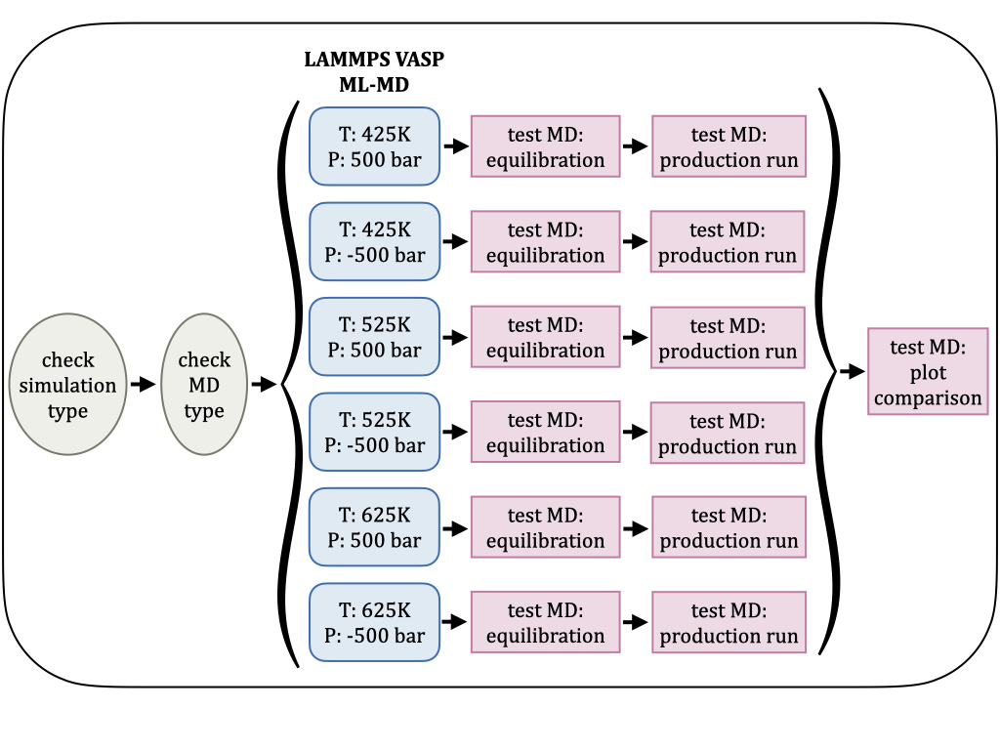
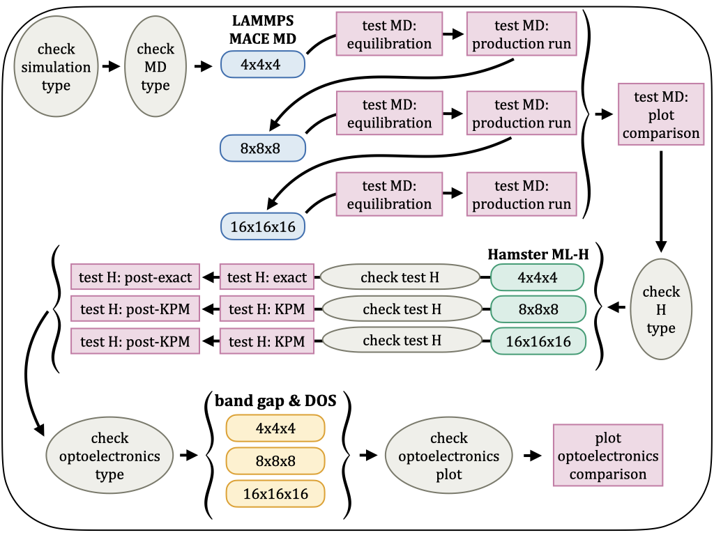

# Examples 🦦

The following examples show some possible applications of `Flow-Otter`. 
The corresponding config YAML files are in this directory.
Each example is visualized using a scheme that shows the created branches and workflow tasks (except buffer tasks).  

Please adjust the parameters marked with `# INSERT HERE` and `# ADAPT THIS TO YOUR SYSTEM` accordingly.   

## Temperature and pressure sweep with VASP ML-MD

flow executable: `flow_MD.py`  
config YAML file: `otter_T_P_sweep.yaml`  

## Size transferability test with MACE ML-MD and Hamster Hamiltonians

flow executable: `flow.py`  
config YAML file: `otter_size_transfer.yaml`  

The **Hamster ML-H** and **band gap & DOS** boxes contain several tasks which are left out for readablity. 
A **Hamster** box includes a `prepare_hamster` and `hamster` task, while the **band gap & DOS** boxes incorparate the tasks `bandgap+dos_KPM`, `bandgap+dos_post_KPM`, and `gap_KPM` or `bandgap+dos_exact` and `bandgap+dos_post_exact` depending on the Hamiltonian size.

## Temperature sweep for optical conductivities with empirical force fields and tight-binding Hamiltonians

*Not supported yet!*

flow executable: `flow.py`  
config YAML file: `otter_conductivity.yaml`  
